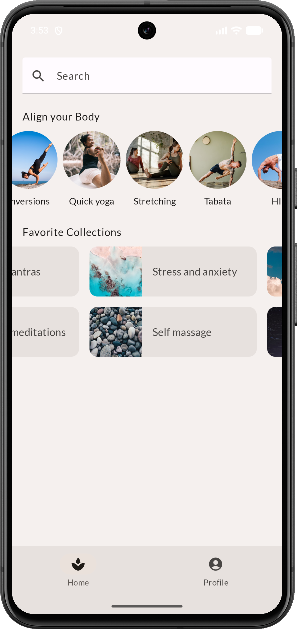
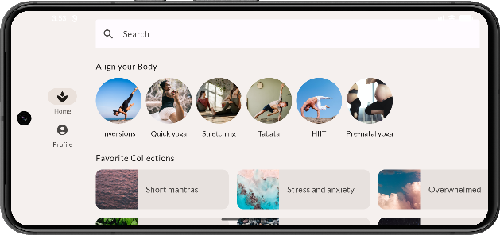

#### Soothe
- reference: [Compose 中的基本布局](https://developer.android.com/codelabs/jetpack-compose-layouts?hl=zh-cn#0)

#### Source code
- 课程
  - 中级（面向 Android 开发者的 Jetpack Compose）：[link](https://developer.android.com/courses/jetpack-compose/course?hl=zh-cn)
- code
  - [Github](https://github.com/android/codelab-android-compose)
  - 本节源码位于 ~/codelab-android-compose/BasicLayoutsCodelab, branch: end

#### 效果
- 竖屏
- 
- 横屏
- 
